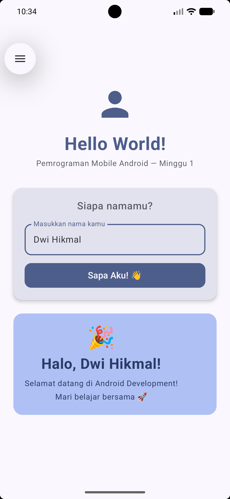

# 📱 Hello World — Pemrograman Mobile Android
## Minggu 1 | Semester 6

---
## Screenshots

berikut adalah tampilan dari aplikasi saya:

|               Home Screen                |                 Output                  |
|:----------------------------------------:|:---------------------------------------:|
|  |  |

---


## 🎯 Tujuan Project

Project ini adalah tugas pertama mata kuliah **Pemrograman Mobile Android**.  
Mahasiswa akan mempelajari:

- Setup Android Studio dan konfigurasi project
- Struktur project Android modern
- Jetpack Compose sebagai UI framework
- State Management dasar dengan `remember` dan `mutableStateOf`
- Material Design 3 components

---

## 🗂 Struktur File

```
HelloWorldAndroid/
├── app/
│   ├── src/main/
│   │   ├── java/com/example/helloworld/
│   │   │   ├── MainActivity.kt              ← Entry point aplikasi
│   │   │   └── ui/
│   │   │       ├── GreetingScreen.kt        ← UI utama (Composable)
│   │   │       └── theme/
│   │   │           ├── Theme.kt             ← Material3 theme setup
│   │   │           ├── Color.kt             ← Definisi warna
│   │   │           └── Type.kt              ← Konfigurasi typography
│   │   ├── res/
│   │   │   └── values/
│   │   │       ├── strings.xml              ← Teks UI (localization)
│   │   │       └── themes.xml               ← XML theme dasar
│   │   └── AndroidManifest.xml              ← Deklarasi aplikasi
│   └── build.gradle.kts                     ← Konfigurasi module
├── gradle/
│   └── libs.versions.toml                   ← Version catalog dependencies
└── build.gradle.kts                         ← Konfigurasi project
```

---

## 🚀 Cara Menjalankan

### Prasyarat
- Android Studio Hedgehog (2023.1.1) atau lebih baru
- JDK 11+
- Android SDK API 35 (download via SDK Manager)

### Langkah
1. Buka Android Studio → **File → Open**
2. Pilih folder `HelloWorldAndroid`
3. Tunggu Gradle sync selesai
4. Buat/pilih emulator: **Device Manager → Create Virtual Device**
   - Pilih: Pixel 6 Pro, API 34, Android 14
5. Klik tombol ▶️ **Run** (Shift + F10)

---

## 📚 Konsep yang Dipelajari

### 1. `@Composable` Function
```kotlin
@Composable
fun GreetingScreen() {
    // Fungsi ini mendeskripsikan UI
    // Kotlin function biasa yang mengembalikan UI, bukan View
}
```

### 2. State Management
```kotlin
// remember → state tidak reset saat recomposition
// mutableStateOf → reaktif, UI otomatis update
var name by remember { mutableStateOf("") }
```

### 3. Layout Dasar
```kotlin
Column {          // Susun elemen secara vertikal
    Row {         // Susun elemen secara horizontal
        Spacer()  // Ruang kosong
    }
}
```

### 4. Modifier
```kotlin
Modifier
    .fillMaxSize()   // Isi seluruh parent
    .padding(16.dp)  // Tambah padding
    .size(72.dp)     // Set ukuran
```

### 5. Material3 Components
```kotlin
OutlinedTextField(value = name, onValueChange = { name = it })
Button(onClick = { /* aksi */ }) { Text("Klik") }
Card { /* konten */ }
```

---

## 📝 Tugas Minggu 1

Modifikasi project ini agar menjadi **Form Sederhana** dengan:
- [ ] TextField untuk **Nama Lengkap**
- [ ] TextField untuk **NIM/NIP**
- [ ] Button **Submit**
- [ ] Tampilkan data yang diinput setelah Submit

**Bonus:** Tambahkan validasi (NIM harus berupa angka, nama tidak boleh kosong)

---

## 🔗 Referensi

- [Android Developers](https://developer.android.com)
- [Jetpack Compose Docs](https://developer.android.com/jetpack/compose)
- [Kotlin Docs](https://kotlinlang.org/docs)
- [Material Design 3](https://m3.material.io)
